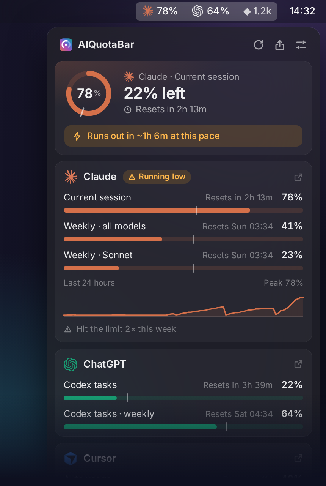
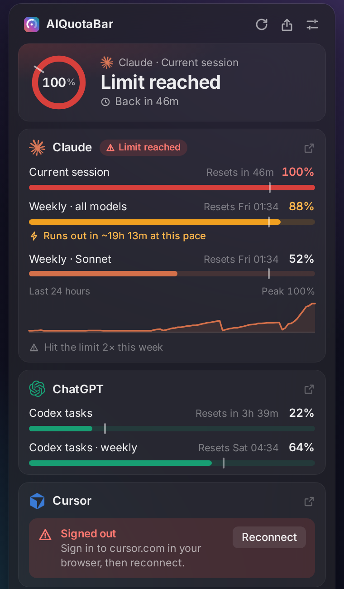
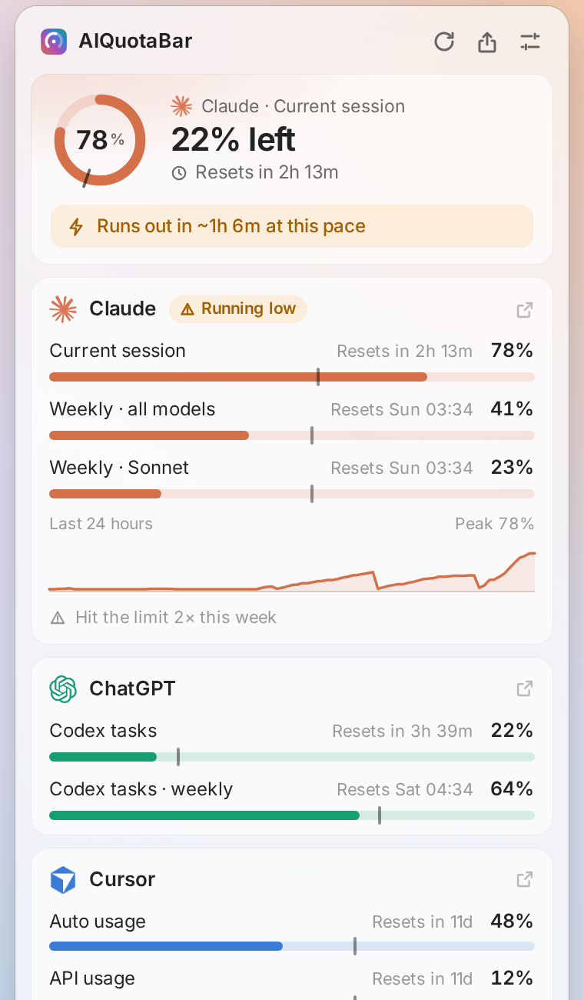
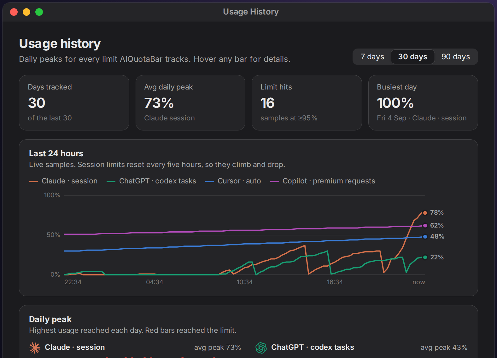
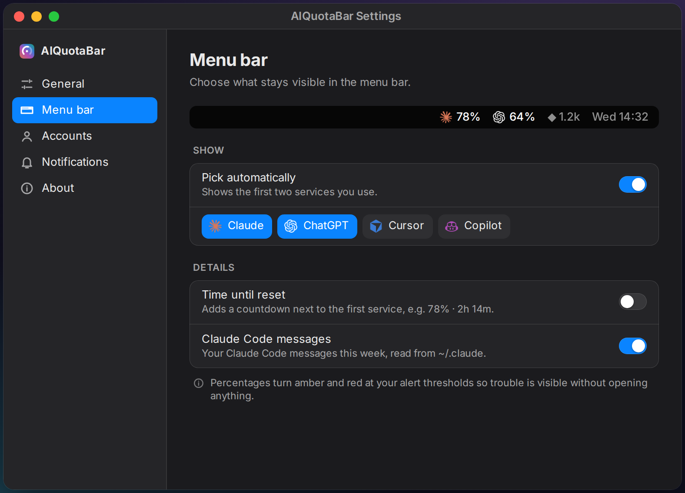
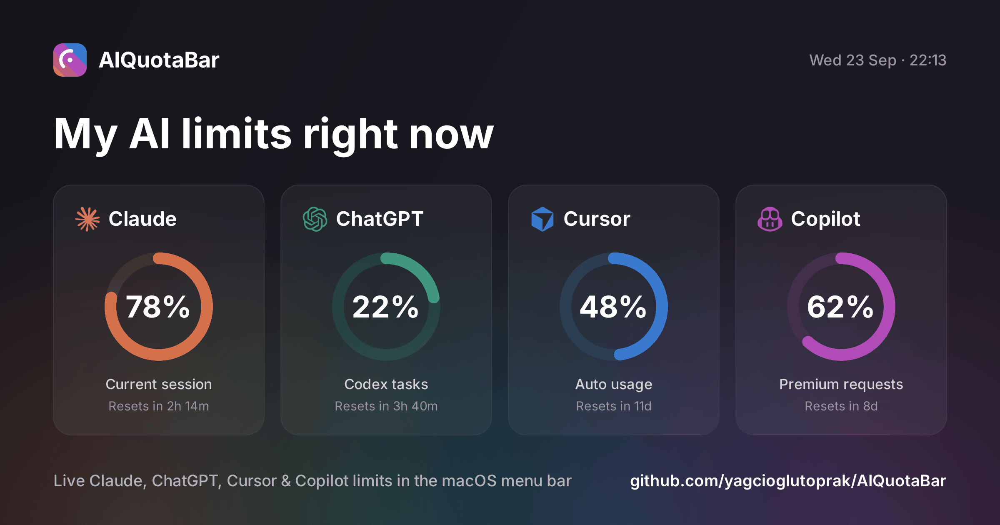

<div align="center">


# AIQuotaBar

**Your Claude, ChatGPT, Cursor and Copilot limits — live in the macOS menu bar.**<br>
See what's left, when it resets, and get warned *before* you're cut off.

[](https://github.com/yagcioglutoprak/AIQuotaBar/releases/latest)
[](https://github.com/yagcioglutoprak/AIQuotaBar/stargazers)
[](https://github.com/yagcioglutoprak/AIQuotaBar/releases)
[](#install)
[](LICENSE)

</div>

```bash
curl -fsSL https://raw.githubusercontent.com/yagcioglutoprak/AIQuotaBar/main/install.sh | bash
```

<p align="center"><sub>Free and open source · No Electron · No browser extension · Nothing leaves your Mac except requests to each service</sub></p>



### What you get

- **Every limit in one place** — Claude's 5-hour session and weekly caps, ChatGPT Codex, Cursor and Copilot, each with a live reset countdown.
- **A warning before you hit the wall** — *"Runs out in ~1h at this pace"* when your current pace would beat the reset.
- **Pace markers** — a tick on every bar shows where an even pace would put you, so you know whether to slow down.
- **A glanceable menu bar** — numbers turn orange, then red, as you get close.
- **Alerts you control** — warning, critical, pace and "you're back" notifications, per service.
- **History and sharing** — 24-hour trends, daily peaks, a 90-day calendar and a one-click share image.
- **Zero setup** — it reuses the sessions already in your browser. No API keys, no copy-pasting.

<br clear="right">

## Why

I kept getting cut off mid-session on Claude Pro with no warning. claude.ai doesn't show your usage until you hit the wall — and neither do ChatGPT, Cursor or Copilot. AIQuotaBar keeps all of them one glance away.

## Supported services

| Service | What it tracks | How it connects |
|---|---|---|
| **Claude** | 5-hour session · weekly (all models, Sonnet, Opus) | Your claude.ai browser session |
| **ChatGPT / Codex** | 5-hour and weekly Codex limits | Your chatgpt.com session |
| **Cursor** | Auto and API usage of your plan | Your cursor.com session |
| **GitHub Copilot** | Premium requests this month | Your github.com session |
| **Claude Code** | Messages, sessions and tool calls | Local stats in `~/.claude` |
| **OpenAI · MiniMax · GLM** | API spend or balance *(optional)* | An API key in Settings |

Sessions are found automatically in Chrome, Arc, Brave, Edge, Firefox and Safari.

## A quick tour

**The menu bar** shows a number for each service you pick (the first two by default). For Claude it's the 5-hour session — the limit that decides whether you can keep working right now.

| You see | It means |
|---|---|
| `78%` | You're fine |
| `83%` in orange | Past your warning threshold (80% by default) |
| `100%` in red | Rate-limited — the panel shows when you're back |
| `78% ·` | Session is fine, but a weekly limit is maxed |

**Click it** for the panel. The top card always shows the limit closest to cutting you off; below it, every service with its limits, reset times and a 24-hour trend.

<table>
<tr>
<td width="50%"><br><b>Warnings that tell you what to do</b> — when you're back, what's running low, and a one-click fix when you're signed out.</td>
<td width="50%"><br><b>Light and dark</b> — follows your Mac, with bars that turn orange and red as you get close.</td>
</tr>
<tr>
<td><br><b>Usage history</b> — 24-hour trends, daily peaks and a 90-day activity calendar.</td>
<td><br><b>Settings</b> — choose what the menu bar shows, set your alert thresholds and manage accounts.</td>
</tr>
</table>

**Share your limits** — copy, save or post a clean image to X in one click:

<p align="center"></p>

**Desktop widget** — a native WidgetKit widget for your desktop and Notification Center, set up by the installer. Right-click the desktop → *Edit Widgets* → search "AI Quota".

<p align="center"></p>

## Install

**Recommended.** Installs to `~/.ai-quota-bar`, starts at login and keeps itself up to date:

```bash
curl -fsSL https://raw.githubusercontent.com/yagcioglutoprak/AIQuotaBar/main/install.sh | bash
```

Look for the icon in your menu bar. On first launch, a welcome window shows which accounts it found.

**Requirements:** macOS 12+, Python 3.10+, and a paid plan on at least one supported service.

<details>
<summary><b>Other ways to install</b></summary>

**Homebrew**
```bash
brew tap yagcioglutoprak/aiquotabar
brew install --HEAD aiquotabar
aiquotabar &                      # update later with: brew upgrade --fetch-HEAD aiquotabar
```

**From source**
```bash
git clone https://github.com/yagcioglutoprak/AIQuotaBar.git && cd AIQuotaBar
pip install -r requirements.txt
python3 claude_bar.py            # add --demo to try it with sample data, no accounts needed
```
</details>

<details>
<summary><b>Uninstall</b></summary>

```bash
launchctl bootout gui/$(id -u) ~/Library/LaunchAgents/com.claudebar.plist 2>/dev/null
pkill -f claude_bar.py
rm -rf ~/.ai-quota-bar ~/Library/LaunchAgents/com.claudebar.plist \
       ~/.claude_bar_config.json ~/.claude_bar_history.json \
       "$HOME/Library/Application Support/AIQuotaBar"
rm -rf /Applications/AIQuotaBarHost.app      # the desktop widget, if installed
```
</details>

## Privacy

- **Local only.** Session cookies are read from your browser on your Mac and stored only in `~/.claude_bar_config.json`.
- **Direct requests.** It calls the same usage endpoints each provider's own settings page uses, straight from your Mac. There's no AIQuotaBar server, no analytics and no telemetry.
- **One Keychain prompt.** Chrome, Arc, Brave and Edge encrypt cookies with a key kept in the Keychain, so macOS asks once — choose **Always Allow**. Firefox needs no prompt.
- **Lightweight.** The panel is plain HTML drawn by macOS's built-in WebKit, not Electron.

## FAQ

<details>
<summary><b>It doesn't find my account</b></summary>

Sign in to the service in your browser, then open **Settings → Accounts → Detect** (or click **Reconnect** on the card). For Claude you can also paste a cookie manually on the same page.
</details>

<details>
<summary><b>What does the tick on each bar mean?</b></summary>

It marks where you'd be if you spread the limit evenly across its window. If your bar is past the tick, you're using it faster than that — the panel tells you when that pace would run you out before the reset.
</details>

<details>
<summary><b>Nothing shows up in the menu bar</b></summary>

Check the log with `tail -50 ~/.claude_bar.log`. On a crowded menu bar, macOS may hide icons behind the notch — try quitting another menu bar app.
</details>

## Why not just check the settings page?

| | AIQuotaBar | Provider settings pages | Browser extensions |
|---|---|---|---|
| Always visible | ✅ Menu bar + widget | ❌ Open each site | ⚠️ Badge only |
| Warns before you run out | ✅ Thresholds + pace | ❌ | ⚠️ Varies |
| All services in one place | ✅ | ❌ | ❌ |
| Stays on your Mac | ✅ | ✅ | ⚠️ Depends |

## Contributing

**Next up:** Linux and Windows tray apps, multiple Claude accounts, Gemini — see the [releases](https://github.com/yagcioglutoprak/AIQuotaBar/releases) for what's shipped. PRs are welcome — please open an issue first for big changes. `python3 claude_bar.py --demo` runs the app with sample data, and `pip install -r requirements-dev.txt && python3 -m pytest` runs the test suite (it works on Linux too). Architecture notes are in [CLAUDE.md](CLAUDE.md).

<div align="center">

**If AIQuotaBar saved you from a surprise rate limit, a ⭐ helps other developers find it.**

[](https://github.com/yagcioglutoprak/AIQuotaBar/stargazers)

</div>

---

MIT licensed — see [LICENSE](LICENSE). Not affiliated with Anthropic, OpenAI, Anysphere (Cursor) or GitHub. AIQuotaBar uses undocumented APIs that may change without notice.
