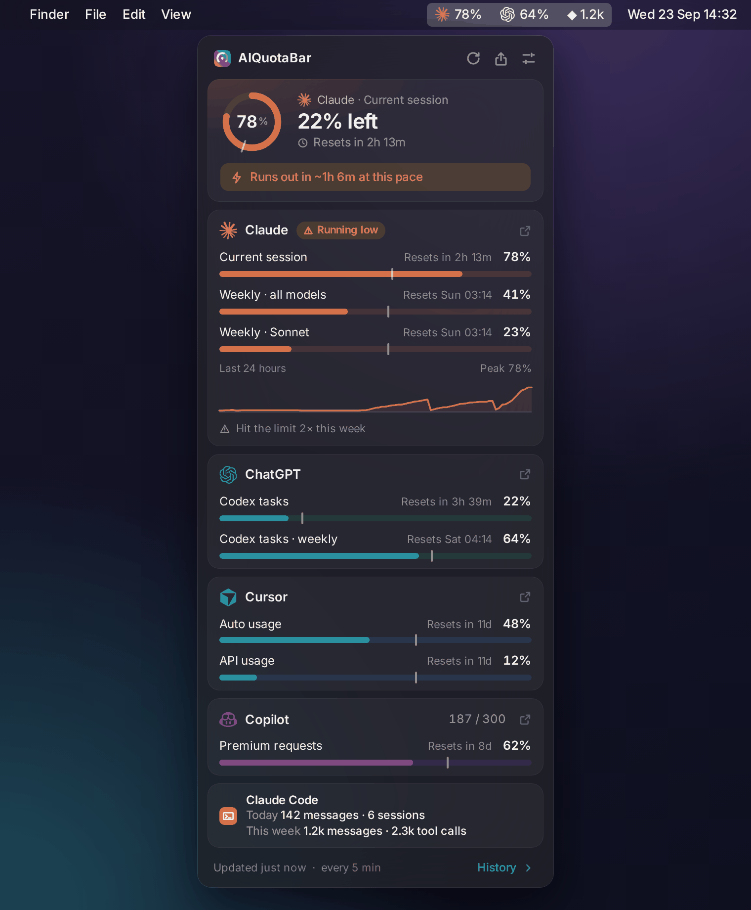
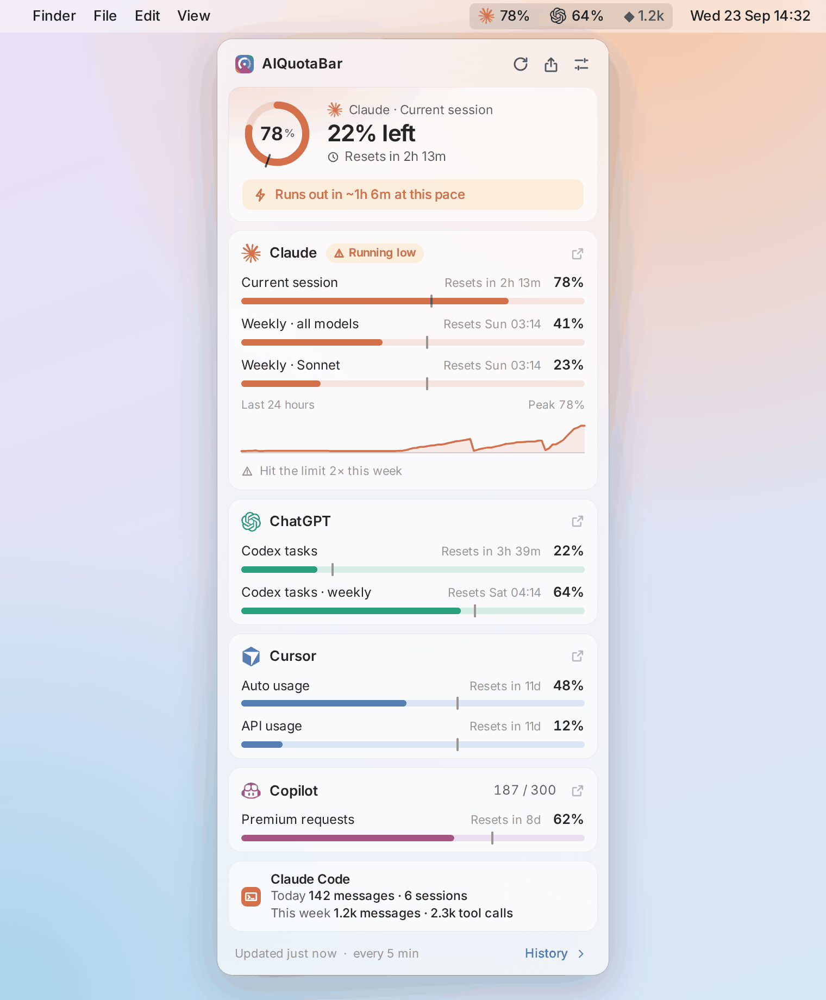
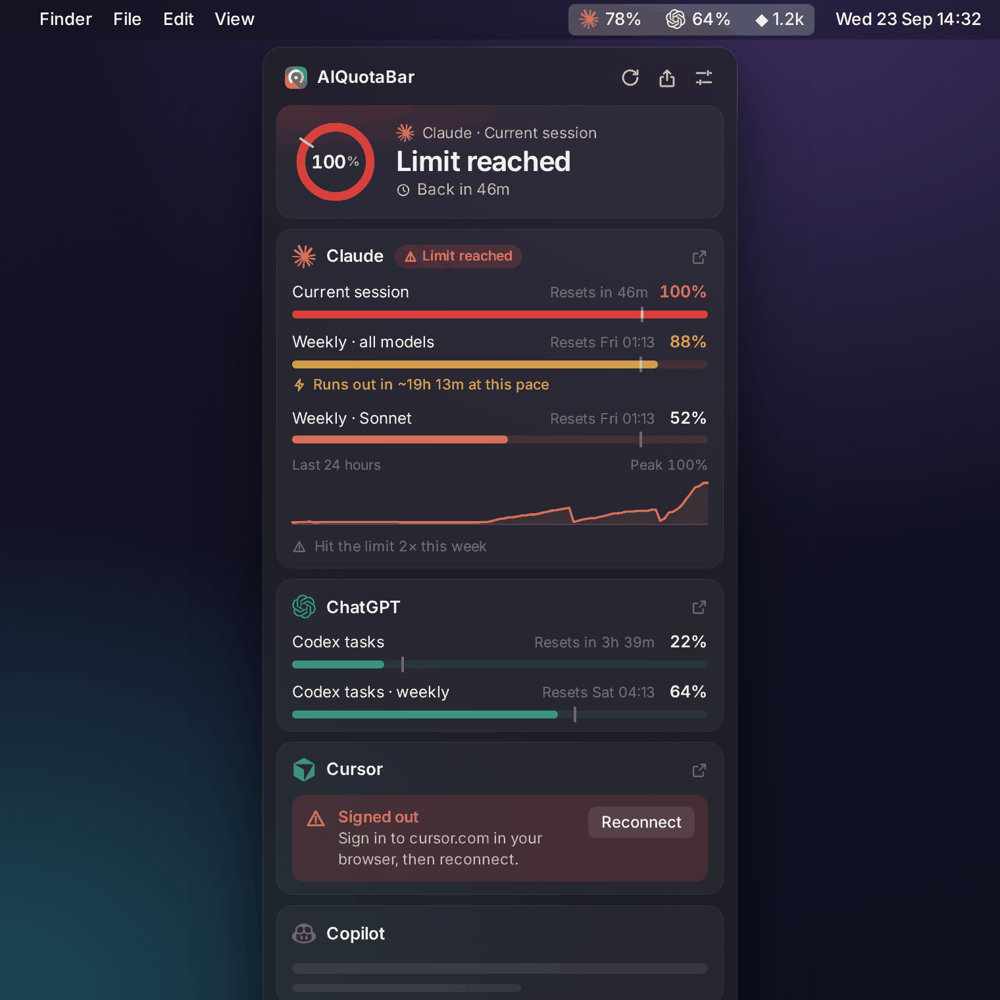
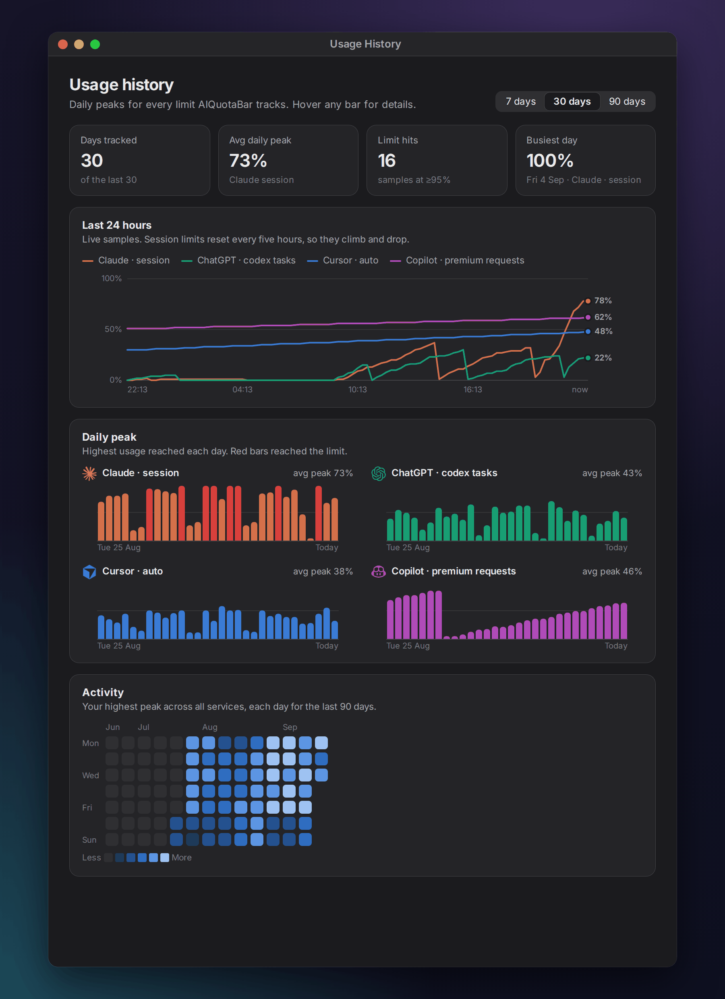
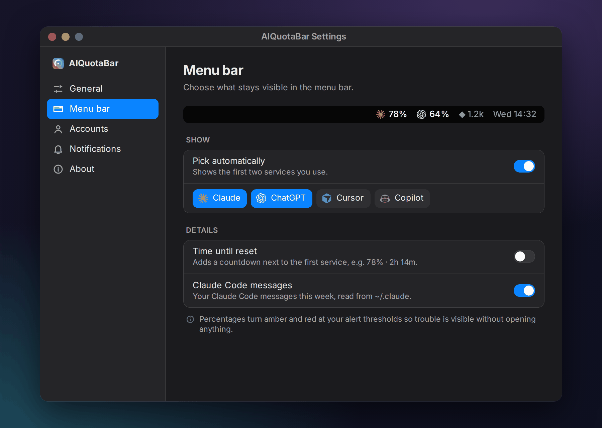

# AIQuotaBar

**Stop getting rate-limited by surprise.** See your Claude, ChatGPT, Cursor, and Copilot usage live in the macOS menu bar — and get warned *before* you run out.

No Electron. No browser extension. One command to install.

<p align="center">


</p>
<p align="center">

</p>

[](LICENSE)
[](https://github.com/yagcioglutoprak/AIQuotaBar/stargazers)
[](https://github.com/yagcioglutoprak/AIQuotaBar/releases)
[](https://github.com/yagcioglutoprak/AIQuotaBar/releases/latest)

---

## Install

**One-line (recommended):**
```bash
curl -fsSL https://raw.githubusercontent.com/yagcioglutoprak/AIQuotaBar/main/install.sh | bash
```

**Homebrew:**
```bash
brew tap yagcioglutoprak/aiquotabar
brew install --HEAD aiquotabar
aiquotabar &
```

The app launches immediately and auto-detects your Claude, ChatGPT, Cursor, and Copilot sessions from Chrome, Arc, Brave, Edge, Firefox, or Safari — no copy-pasting cookies.

---

### Why I built this

I kept getting cut off mid-session on Claude Pro with zero warning. Claude.ai doesn't show your usage until you hit the wall. Same with ChatGPT, Cursor, and Copilot. So I built a tiny menu bar app that shows them all.

---

## What it shows

| Menu bar | Meaning |
|---|---|
| `78%` | Session usage — plain when you're fine |
| `83%` in orange | Past your warning threshold (80% by default) |
| `100%` in red | Rate-limited — the panel shows when you're back |
| `78% ·` | Session is fine but a weekly limit is maxed |

Click it for the panel: every limit with its reset countdown, a **pace marker** (where an even pace would put you), a "runs out in ~1h at this pace" warning, and a 24-hour trend.

<p align="center">



</p>

**Share it** — one click turns your current limits into an image for X, Slack or a README:

<p align="center"></p>

---

## Desktop Widget (NEW)

Native macOS WidgetKit widget — see your AI usage right on your desktop or in Notification Center.

**Small widget:** Claude + ChatGPT percentages at a glance, color-coded by brand.

**Medium widget:** Side-by-side breakdown with session limits, weekly caps, progress bars, and reset times.

The widget syncs automatically with the menu bar app — no extra setup. Data updates every 60 seconds.

```bash
# Build the widget (requires Xcode)
cd AIQuotaBarWidget && ./build_widget.sh
# Then: right-click desktop → Edit Widgets → search "AI Quota"
```

> The widget is entirely optional — the menu bar app works without it. Requires macOS 14+ and Xcode 15+.

---

## Features

- **Zero-setup auth** — reuses your browser sessions (Chrome, Arc, Brave, Edge, Firefox, Safari); reconnects itself when a session expires
- **Claude + ChatGPT + Cursor + Copilot** — Claude session/weekly (incl. Sonnet/Opus), Codex 5-hour and weekly windows, Cursor Auto/API, Copilot premium requests
- **Pace tracking** — see whether you're ahead of an even pace, and when you'll run out before the reset
- **Alerts you control** — warning/critical thresholds, pace alerts and reset alerts per service
- **Usage history** — 24-hour trends, daily peaks and a 90-day activity calendar
- **Share card** — copy or post a clean image of your limits
- **Desktop widget** — native WidgetKit widget; plus OpenAI / MiniMax / GLM API spend
- **Light & dark**, runs at login, one-click settings — and nothing leaves your Mac except requests to each provider

---

## Why not just check the settings page?

| | AIQuotaBar | Open settings page | Browser extension |
|---|---|---|---|
| Always visible | ✅ Menu bar + desktop widget | ❌ Manual tab switch | ⚠️ Badge only |
| Notifications | ✅ 80% + 95% + pacing alerts | ❌ None | ⚠️ Varies |
| Claude + ChatGPT + Cursor + Copilot | ✅ All in one place | ❌ One at a time | ❌ |
| Desktop widget | ✅ Native WidgetKit | ❌ | ❌ |
| Privacy | ✅ Local only | ✅ | ⚠️ Depends on extension |
| Install | ✅ One command | ✅ Nothing | ❌ Store + permissions |
| No Electron | ✅ Python + system WebKit | ✅ | ❌ Often Electron |

---

## Requirements

- macOS 12+
- Python 3.10+
- A paid account for any supported service (Claude, ChatGPT, Cursor, or Copilot)
- Chrome, Arc, Brave, Edge, Firefox, or Safari with an active session

---

## Manual install

```bash
git clone https://github.com/yagcioglutoprak/AIQuotaBar.git
cd AIQuotaBar
pip install -r requirements.txt
python3 claude_bar.py          # or: python3 claude_bar.py --demo  (sample data, no accounts)
```

---

## How it works

The app calls the same private usage API that `claude.ai/settings/usage` uses. It authenticates using your browser's existing session cookies (read locally — never transmitted anywhere except to `claude.ai`).

[`curl_cffi`](https://github.com/yifeikong/curl_cffi) mimics a browser TLS fingerprint, which Cloudflare requires. The panel is plain HTML/CSS rendered by the system's WebKit (`aiquotabar/web/`), fed by a platform-independent view model — so the UI is tested and screenshotted in CI-style headless browsers (`python3 tools/screenshots.py`).

---

## Troubleshooting

**App doesn't appear in menu bar**
```bash
tail -50 ~/.claude_bar.log
```

**Cookies not detected / signed out**
Log into the service in your browser, then **Settings → Accounts → Detect** (or **Reconnect** on the card). For Claude you can also paste a cookie manually there.

---

## Roadmap

- [x] Homebrew tap (`brew tap yagcioglutoprak/aiquotabar && brew install --HEAD aiquotabar`)
- [x] Native macOS desktop widget (WidgetKit)
- [x] Cursor IDE usage tracking (Auto + API)
- [x] GitHub Copilot premium request tracking
- [x] Burn rate ETA + pacing alerts
- [ ] Linux system tray support
- [ ] Windows tray app
- [x] Customizable notification thresholds
- [x] Usage history graph
- [x] Pace tracking + share card
- [ ] Multiple Claude account support

---

## Contributing

PRs welcome. Open an issue first for large changes. See [Manual install](#manual-install) for dev setup. Logs: `~/.claude_bar.log`.

---

## License

MIT — see [LICENSE](LICENSE).

## Disclaimer

Not affiliated with or endorsed by Anthropic. Uses undocumented internal APIs that may change without notice.
